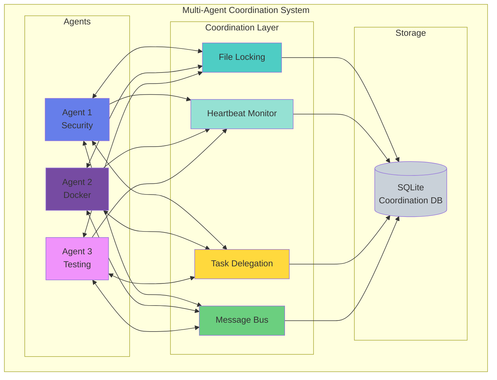
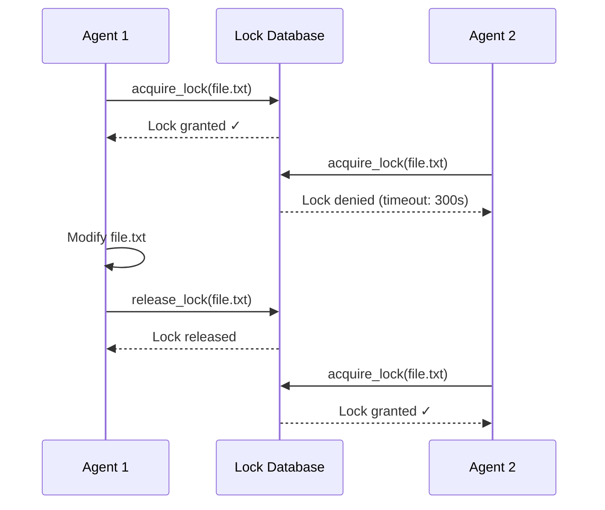
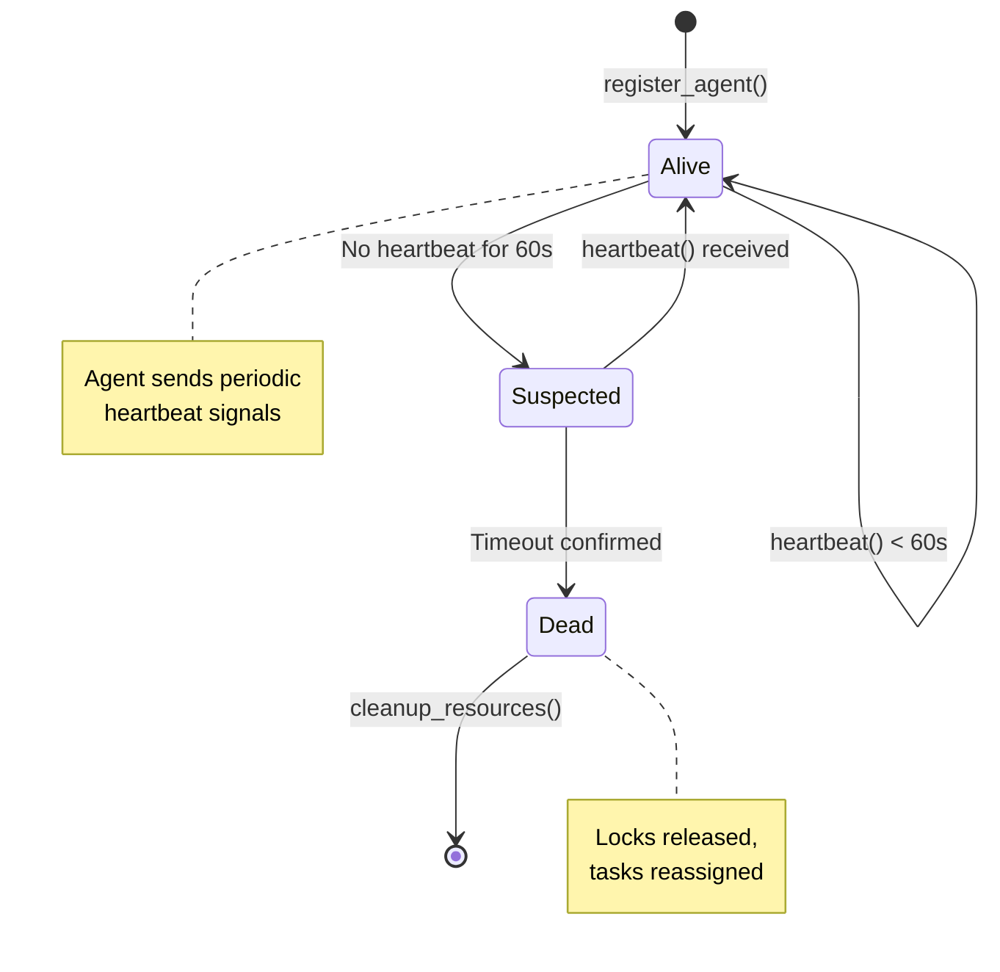
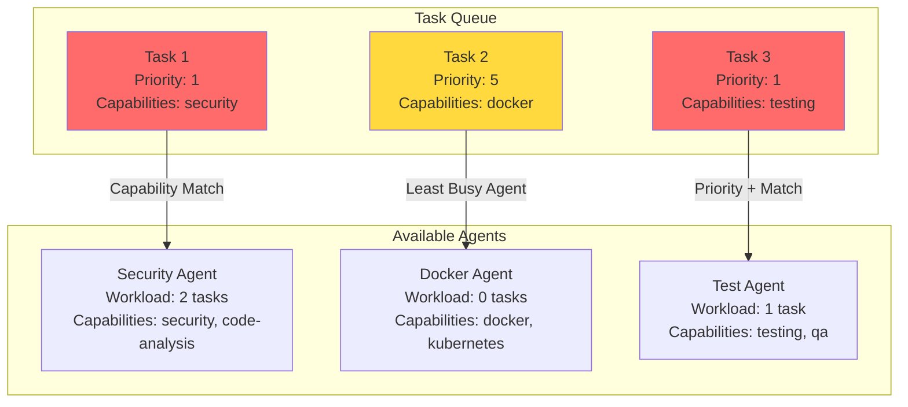
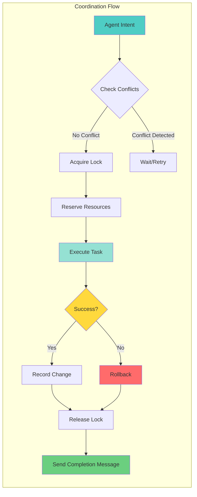

# Multi-Agent Coordination Theory: Research Prototypes

[](https://opensource.org/licenses/MIT)
[](https://github.com)

**Educational implementations of distributed coordination algorithms for autonomous AI agent systems.**

## Overview

This repository contains **educational prototypes** exploring coordination theory for multi-agent systems, with a focus on AI agents that need to collaborate while avoiding conflicts. All code is conceptual and designed for research and learning purposes.



### Research Context

Modern AI systems increasingly involve multiple autonomous agents working on shared resources. This research explores:

- **Distributed mutual exclusion** (file locking algorithms)
- **Heartbeat-based liveness detection** (agent health monitoring)
- **Task delegation patterns** (work distribution strategies)
- **Priority queuing** (task scheduling)
- **Dependency resolution** (task ordering)
- **Message passing** (inter-agent communication)

These concepts draw from decades of distributed systems research, adapted for AI agent coordination scenarios.

## Core Concepts

### 1. File Locking (Mutual Exclusion)

When multiple agents modify shared resources (files, databases), we need coordination primitives to prevent conflicts. This repo implements:

- **Pessimistic locking**: Acquire exclusive access before modification
- **Timeout-based locks**: Automatic expiration prevents deadlocks
- **Lock queuing**: Fair access for waiting agents
- **Change history**: Audit trail for debugging



**Key Papers:**
- Lamport, L. (1978). "Time, Clocks, and the Ordering of Events in a Distributed System"
- Ricart, G., & Agrawala, A. K. (1981). "An optimal algorithm for mutual exclusion"

### 2. Heartbeat-Based Liveness

Agents periodically signal their liveness via heartbeats. If heartbeats stop, the agent is presumed dead and its resources are released.

- **Timeout detection**: Configurable heartbeat intervals
- **Graceful degradation**: Automatic cleanup of stale agents
- **Resource reclamation**: Release locks from failed agents



**Key Papers:**
- Chandra, T. D., & Toueg, S. (1996). "Unreliable failure detectors for reliable distributed systems"

### 3. Task Delegation

Complex work is broken into tasks and distributed across capable agents:

- **Capability matching**: Route tasks to specialized agents
- **Priority queuing**: High-priority tasks execute first
- **Dependency graphs**: Enforce execution order
- **Workload balancing**: Distribute tasks evenly



**Key Papers:**
- Weiss, G. (1999). "Multiagent Systems: A Modern Approach to Distributed AI"

### 4. Distributed Coordination

Agents coordinate without centralized control:

- **Message bus**: Publish-subscribe communication
- **Resource reservations**: CPU/memory allocation
- **Rollback mechanisms**: Recover from failures
- **Conflict detection**: Identify concurrent modifications



**Key Papers:**
- Brewer, E. A. (2000). "Towards robust distributed systems" (CAP theorem)
- Pasquini, D., et al. (2024). "Hacking Back the AI-Hacker: Prompt Injection as a Defense Against LLM-driven Cyberattacks"

## Repository Structure

```
coordination-research-prototypes/
├── src/
│   ├── file_locking.py          # File locking algorithm
│   ├── heartbeat_monitor.py     # Agent liveness detection
│   ├── task_delegation.py       # Task distribution patterns
│   ├── priority_queue.py        # Priority-based scheduling
│   ├── message_bus.py           # Inter-agent messaging
│   └── dependency_resolver.py   # Task dependency graphs
├── examples/
│   ├── basic_coordination.py    # Simple coordination example
│   ├── multi_agent_workflow.py  # Complex workflow example
│   └── conflict_resolution.py   # Handling conflicts
├── docs/
│   ├── ALGORITHMS.md            # Algorithm descriptions
│   ├── RESEARCH_NOTES.md        # Research findings
│   └── REFERENCES.md            # Academic citations
├── tests/
│   └── test_*.py                # Unit tests
├── LICENSE
└── README.md
```

## Educational Examples

### Basic File Locking

```python
from src.file_locking import FileLockCoordinator

# Initialize coordinator with SQLite backend
coordinator = FileLockCoordinator(db_path="coordination.db")

# Agent A acquires lock
agent_a_id = "agent-a"
file_path = "/shared/config.json"

success = coordinator.acquire_lock(
    agent_id=agent_a_id,
    file_path=file_path,
    operation="write",
    timeout_seconds=30
)

if success:
    # Modify file
    print("Modifying file...")

    # Record change
    coordinator.record_change(
        agent_id=agent_a_id,
        file_path=file_path,
        change_type="modified"
    )

    # Release lock
    coordinator.release_lock(agent_id=agent_a_id, file_path=file_path)
```

### Heartbeat Monitoring

```python
from src.heartbeat_monitor import HeartbeatMonitor
import time

monitor = HeartbeatMonitor(timeout_seconds=60)

# Register agent
monitor.register_agent(
    agent_id="worker-01",
    capabilities=["data-processing", "analysis"]
)

# Send periodic heartbeats
for i in range(10):
    monitor.send_heartbeat(
        agent_id="worker-01",
        status=f"Processing batch {i}"
    )
    time.sleep(30)  # Heartbeat every 30 seconds

# Get active agents
active_agents = monitor.get_active_agents()
print(f"Active agents: {len(active_agents)}")
```

### Task Delegation

```python
from src.task_delegation import TaskDelegationSystem

system = TaskDelegationSystem()

# Delegate high-priority task
task_id = system.delegate_task(
    description="Analyze security vulnerabilities in codebase",
    task_type="security-audit",
    required_capabilities=["security", "code-analysis"],
    priority=1,  # 1 = highest
    dependencies=[]
)

# Check task status
status = system.get_task_status(task_id)
print(f"Task status: {status['status']}")
print(f"Assigned to: {status['assigned_agent']}")
```

## Installation

```bash
# Clone repository
git clone https://github.com/yourusername/coordination-research-prototypes.git
cd coordination-research-prototypes

# Install dependencies
pip install -r requirements.txt

# Run tests
pytest tests/
```

## Research Applications

This work has potential applications in:

1. **Multi-Agent AI Systems**: Coordinating Claude, GPT, or other LLM agents
2. **Distributed Computing**: General-purpose coordination primitives
3. **Robotics**: Multi-robot coordination and task allocation
4. **Cloud Infrastructure**: Distributed lock managers and task schedulers
5. **Blockchain**: Consensus algorithms and distributed ledgers

## Academic References

### Distributed Systems Theory

1. **Lamport, L.** (1978). "Time, Clocks, and the Ordering of Events in a Distributed System." *Communications of the ACM*, 21(7), 558-565.
   - Foundational work on distributed synchronization

2. **Ricart, G., & Agrawala, A. K.** (1981). "An optimal algorithm for mutual exclusion in computer networks." *Communications of the ACM*, 24(1), 9-17.
   - Optimal distributed mutual exclusion

3. **Chandra, T. D., & Toueg, S.** (1996). "Unreliable failure detectors for reliable distributed systems." *Journal of the ACM*, 43(2), 225-267.
   - Heartbeat-based failure detection

4. **Brewer, E. A.** (2000). "Towards robust distributed systems." *PODC*, 19, 7.
   - CAP theorem and distributed consistency

### Multi-Agent Systems

5. **Weiss, G.** (1999). *Multiagent Systems: A Modern Approach to Distributed AI*. MIT Press.
   - Comprehensive multi-agent systems textbook

6. **Wooldridge, M.** (2009). *An Introduction to MultiAgent Systems*. Wiley.
   - Agent coordination and cooperation

### AI Agent Security

7. **Pasquini, D., Kornaropoulos, E. M., & Ateniese, G.** (2024). "Hacking Back the AI-Hacker: Prompt Injection as a Defense Against LLM-driven Cyberattacks." *arXiv preprint arXiv:2410.20911*.
   - AI agent security and defensive coordination

## Implementation Notes

### Design Principles

1. **Educational Focus**: Code prioritizes clarity over performance
2. **No Production Use**: These are research prototypes, not production systems
3. **Abstract Concepts**: Implementations demonstrate algorithms, not specific tools
4. **SQLite Backend**: Simple, portable database for coordination state
5. **Python Implementation**: Accessible language for research community

### Limitations

- **Single-machine**: No network distribution (yet)
- **SQLite constraints**: Not suitable for high-concurrency production use
- **Basic security**: No authentication or encryption (intentionally simplified)
- **Prototype quality**: Not battle-tested or optimized

### Future Research Directions

- **Byzantine fault tolerance**: Handling malicious agents
- **Consensus algorithms**: Paxos, Raft for agent agreement
- **Encrypted communication**: Secure inter-agent messaging
- **Graph-based scheduling**: Complex task dependency resolution
- **Resource optimization**: Minimize lock contention and latency

## Contributing

This is a research project. Contributions welcome:

- **Algorithm implementations**: Add new coordination algorithms
- **Performance analysis**: Benchmark existing implementations
- **Research papers**: Document findings and publish results
- **Educational materials**: Improve documentation and examples

## License

MIT License - See [LICENSE](LICENSE) file

## Acknowledgments

This research builds on decades of distributed systems theory and recent advances in AI agent coordination. Special thanks to:

- Leslie Lamport for foundational distributed systems work
- The academic research community for rigorous theoretical foundations
- Open source projects exploring practical AI agent coordination

## Citation

If you use this work in academic research, please cite:

```bibtex
@misc{coordination-research-prototypes,
  title={Multi-Agent Coordination Theory: Research Prototypes},
  author={Research Contributor},
  year={2025},
  publisher={GitHub},
  howpublished={\\url{https://github.com/yourusername/coordination-research-prototypes}}
}
```

## Contact

For questions or collaboration opportunities, please open an issue on GitHub.

---

**Disclaimer**: This repository contains educational research prototypes. Do not use in production systems without significant hardening, testing, and security review.
